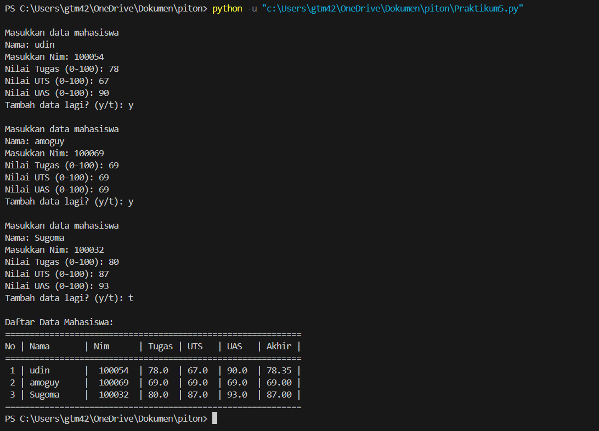

# Program Menghitung Data Nilai Akhir Mahasiswa
Program ini merupakan berbasis list yang digunakan untuk menyimpan dan menghitung nilai akhir mahasiswa. 
Nilai akhir dihitung berdasarkan bobot tertentu dari nilai tugas, UTS, dan UAS.
# Deskripsi Program
Program ini dibuat menggunakan bahasa python dengan fitur:
- List dan Dictionary untuk penyimpanan data.
- Fungsi Kustom (def) untuk perhitungan nilai akhir.
- input() dan int() untuk input dan konversi data.
- while dan if untuk kontrol alur.
- append() dan break untuk menambah data ke list dan menghentikan perulangan.
- print() dan F-string untuk mencetak hasil dalam bentuk tabel yang terformat.
## Flowchart Programan

# Kode Program
```python
# List untuk menyimpan data mahasiswa
DM = []

while True:
    print("\nMasukkan data mahasiswa")
    nama = input("Nama: ")
    nim = input("Masukkan Nim: ")
    tugas = float(input("Nilai Tugas (0-100): "))
    uts = float(input("Nilai UTS (0-100): "))
    uas = float(input("Nilai UAS (0-100): "))

    # Hitung nilai akhir
    nilai_akhir = (tugas * 0.3) + (uts * 0.35) + (uas * 0.35)

    # tambahkan data ke dalam list
    DM.append({
        "Nama": nama,
        "Nim": nim,
        "tugas": tugas,
        "uts": uts,
        "uas": uas,
        "nilai_akhir": nilai_akhir
    })

    # menambah data lagi
    tambah_data = input("Tambah data lagi? (y/t): ")
    if tambah_data == 't':
        break

# Tampilkan daftar data mahasiswa
print("\nDaftar Data Mahasiswa:")
print("No | Nama       | Nim      | Tugas | UTS   | UAS   | Nilai Akhir")
print("-" * 70)
for i, mahasiswa in enumerate(DM, start=1):
    print(f"{i:2} | {mahasiswa['Nama']:<10} |  {mahasiswa['Nim']:<7} | {mahasiswa['tugas']:<5} | {mahasiswa['uts']:<5} | {mahasiswa['uas']:<5} | {mahasiswa['nilai_akhir']:.2f}")

```
# Output Program



# Cara Kerja Program
1. Program pertama kali menginisialisasi list kosong bernama data_mahasiswa untuk menyimpan data setiap mahasiswa.
2. Fungsi hitung_nilai_akhir digunakan untuk menghitung nilai akhir berdasarkan formula:
   \[
   \text{nilai akhir} = (\text{nilai tugas} \times 0.3) + (\text{nilai UTS} \times 0.35) + (\text{nilai UAS} \times 0.35)
   \]
3. Program meminta pengguna untuk memasukkan data nama, NIM, nilai tugas, UTS, dan UAS.
4. Setelah nilai akhir dihitung menggunakan fungsi hitung_nilai_akhir, semua data tersebut disimpan dalam dictionary dan ditambahkan ke dalam list data_mahasiswa.
5. Pengguna dapat memilih untuk menambahkan data mahasiswa lain atau mengakhiri proses input.
6. Setelah input selesai, program akan mencetak data mahasiswa dalam bentuk tabel dengan kolom nomor, nama, NIM, nilai tugas, UTS, UAS, dan nilai akhir.